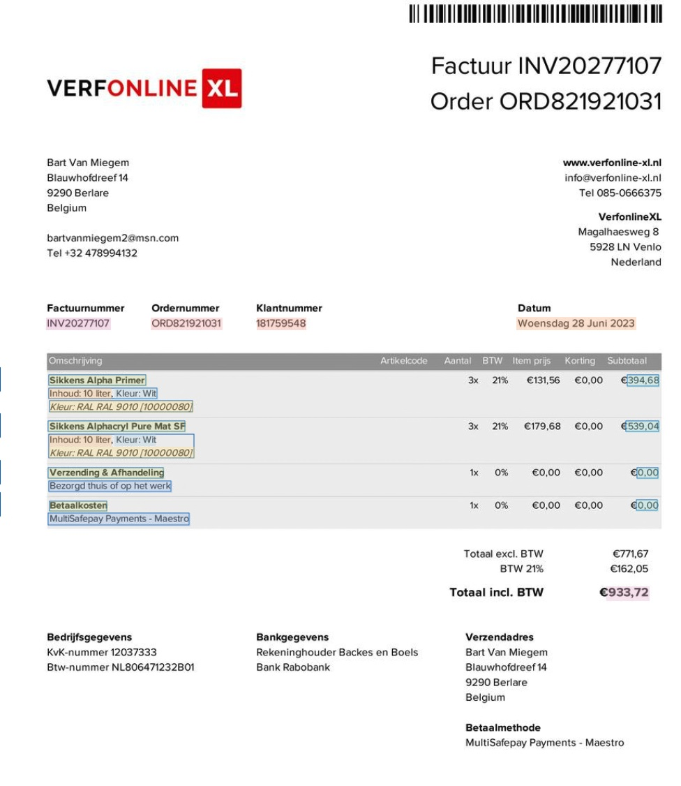

# Technical assessment

## Introduction
During this assessment you will need to complete some parts of the code. We have foreseen already types, helper functions and tests. In the end you should be able to let the mocha test succeed.

## Forking - do not forget!
Before we get started with the assessment, first please **fork** this repository to your private GitHub. 

## Installation
Node version we have used: 18.18.2

Installing dependencies you can do via `npm install`.

Executing test: `npm run test`

## Exercise
We have added some todos in our code. You can easily find them by looking for "TODO:" in the codebase. The idea of this exercise is that you mimic one of the Metamaze clients. They'll receive the `Input` json once their upload has been processed by Metamaze. They will interpret the json and update their system.

In this case, instead of updating the system, we will convert the Input json to another structure.

### Terminology
* **Document**: A document consist of a document type (for example invoices), annotations and entities.
* **Entity**: A document type has "entities". An example of an entity is "invoice number" or "order date". 
* **Annotation**: An annotation is an instance of an entity. "INV20277107" is an example of a invoice number annotation.
* **Refs**: Field in Annotation or Entity. This is a list of ids referring either to parent annotations or entities.

### Files
`src/todo.spec.ts`: We have already written a test. After finishing all todos, this test should succeed.

`src/todo.ts`: 
* **convertInput**: This is the core function you need to implement. It converts the Input json to an Output json. The function is fully typed. Typings you can find in `src/types/input.ts` and `src/types/input.ts`. 
<u>Note:</u> the field **refs** of an entity or annotation is pointing to its parent(s), not to the children!
* **convertEntity**: Converts the input Entity into a ConvertedEntity. The children of the ConvertedEntity needs to be **sorted by name**.
* **convertAnnotation**:  Converts the input Annotation into a ConvertedAnnotation. The children of the ConvertedAnnotation needs to be **sorted by index**. The `ìndex` is the startIndex of the first index of the list of indices, namely `indices[0].startIndex`. In case it's a group (indices = []), take the earliest index of the converted children.
* **sortEntities**: Sorts the entities based on name.
* **sortAnnotations**: Sorts the annotations based on the index of ConvertedAnnotation.
* You can change every function (name, arguments, typings, etc) in `src/todo.ts` as you want. The code that is present is just to give you an indication where you need to head to.
  
`src/input.json`: This is the payload we send to clients too. 

`src/output.json`: The output that should be returned by `convertInput`. This json will be used to test your return value of `convertInput` in `src/todo.spec.ts`. You can use this file as a reference to implement all todos.

`src/document.jpg`: Below you can find the document we are processing. The annotations in the Input payload are highlighted with a color and bounding box.

## Next steps
Soon there will be a verbal technically assessment. During this assessment, we will iterate over your solution. Don't stress if your solution isn't perfect yet. The idea of this exercise is to check your reasoning. 

Make sure you have committed your solution to the `master` branch (on your private repository). Don't forget to push :) 

<h4>Good luck and see you soon!</h4>

